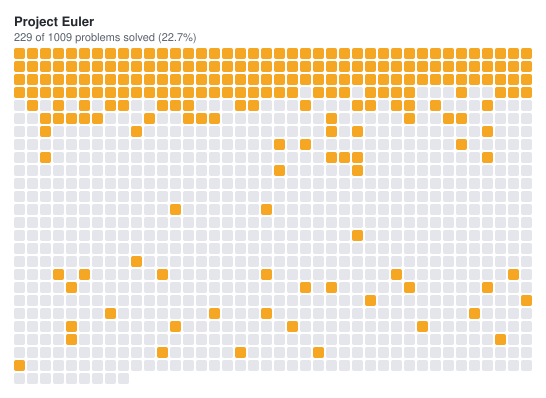

# Project Euler

My [Project Euler](https://projecteuler.net) work, in Python.




## What is and isn't published here

Project Euler asks that solutions beyond problem 100 not be published, so that other people get to
have the same thought you did. **Only solutions to problems 1–100 are in this repository.** The
remaining solutions stay private; the progress grid above is generated from my own solved-problem
list, not from anything belonging to the site.

## Selected awards

<!-- Replace with your own, from https://projecteuler.net/progress (Awards tab). A few good ones
     beat a complete list. -->

- Decathlete — solved ten consecutive problems
- Baby Steps — solved the first twenty-five problems
- ...

## Layout

```
solutions/
  p001.py ... p100.py   # one file per problem, each prints its answer
solved.txt              # my solved-problem IDs, exported from the progress page
progress.svg            # generated by tools/make_progress.py
tools/
  make_progress.py
```

## Regenerating the progress grid

Download **Problems Solved by ID** from [your progress page](https://projecteuler.net/progress)
(the small TXT icon next to the heading), save it as `solved.txt`, then:

```bash
python tools/make_progress.py                 # writes progress.svg
python tools/make_progress.py --total 1009    # if the problem count has moved on
```

The output is a self-contained SVG with no external references, so GitHub renders it inline and it
keeps working offline.

## Notes

Project Euler is number theory and combinatorics with a performance budget attached — most problems
have an obvious brute force that will not finish, and the work is finding the structure that makes
it tractable. It is the closest thing I do outside research to the skill that matters most in
simulation: knowing when an algorithm will not scale before you have spent a week running it.
